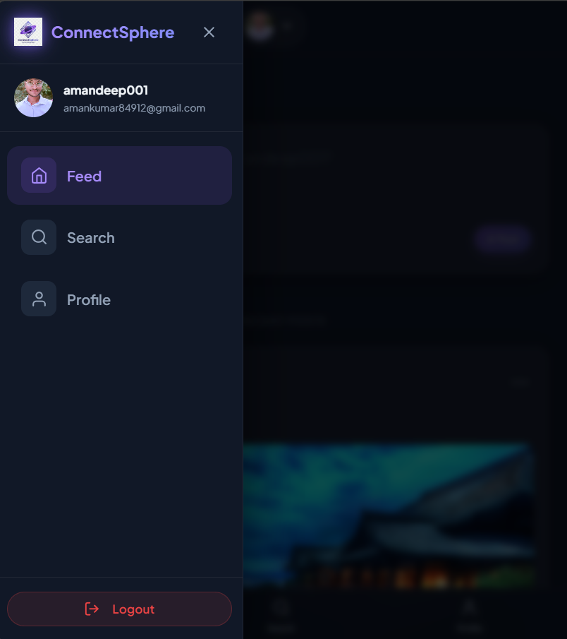
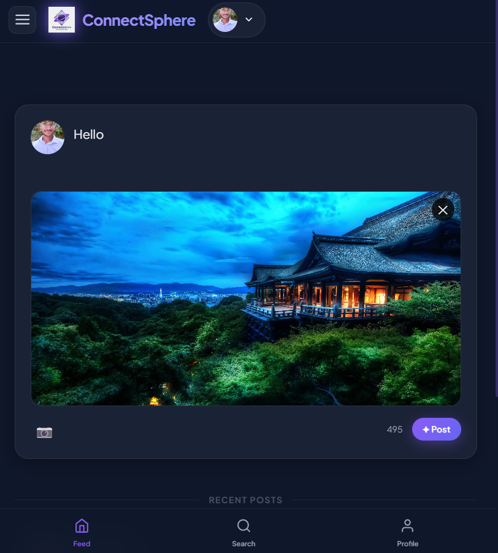
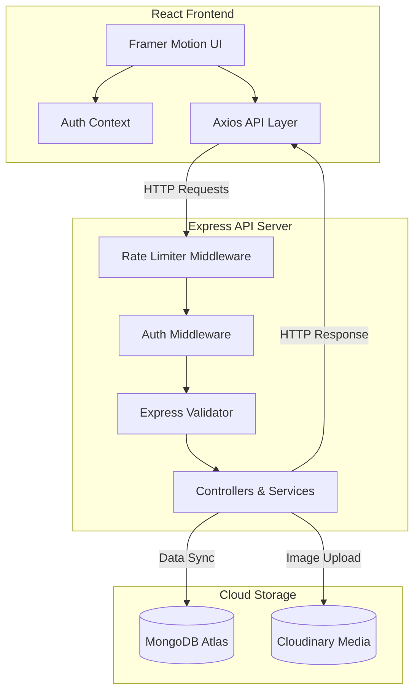

# 🚀 ConnectSphere

### Modern Social Media Platform Built with MERN Stack

[](https://react.dev/)
[](https://nodejs.org/)
[](https://expressjs.com/)
[](https://www.mongodb.com/)
[](https://vercel.com/)
[](https://render.com/)
[](https://opensource.org/licenses/MIT)

ConnectSphere is a premium, portfolio-grade MERN stack social media platform designed with modern SaaS aesthetics, smooth user flows, and a robust backend. It replicates features found on premium platforms like Threads, Instagram, and LinkedIn Web.

[Live Demo](https://connectsphere-client.vercel.app) | [API Documentation](https://connectsphere-server.onrender.com) | [GitHub Repository](https://github.com/amankumar84912-lang/CodeAlpha-SocialMedia-ConnectSphere)

---

## 📷 Screenshots

### Desktop & Core Views

| Homepage (Splash / Entry) | Feed / Dashboard Page |
| :---: | :---: |
|  <br> *Clean and beautiful entry gateway showing brand value* |  <br> *3-column layout displaying user feed, suggestions, and posts* |

| User Profile View | Search & Discovery |
| :---: | :---: |
|  <br> *User statistics, follow mechanics, and user-centric posts grid* |  <br> *Debounced and sanitized search query interface* |

### Account Management & Interactive Flows

| Login Portal | Registration Gateway |
| :---: | :---: |
|  <br> *Secure login interface with session persistence* |  <br> *New user onboarding with active requirements check* |

| Create Post Dialogue | Mobile Layout (Responsive) |
| :---: | :---: |
|  <br> *Create posts with text and optimized Cloudinary image uploads* |  <br> *Responsive mobile view with bottom navigation bar* |

---

## 🌟 Features

### 🔒 Authentication
*   **Secure Registration:** Account creation with email verification and username validation constraints.
*   **JWT session security:** HTTP-friendly local storage token management with automated Bearer attachments on all private transactions.
*   **Password Hashing:** One-way password hashing using `bcryptjs` before committing user details to the database.
*   **Route Protection:** Private route boundaries gating unauthorized users away from private directories (/feed, /profile).

### 🤝 Social Features
*   **Interactive Feed:** Chronological feeds showing posts compiled from followed users and personal uploads.
*   **Optimistic Likes:** Interactive like/unlike states that resolve instantly in the UI with background database synchronization.
*   **Dynamic Comment Thread:** Real-time post discussions with user avatar identities and contextual timestamp details.
*   **Follow / Unfollow Mechanics:** Dynamic social graph support letting users build relationships and filter feeds dynamically.
*   **Filtered User Search:** Search queries matching usernames in real-time, built with debouncing and query sanitization.

### 👤 Profile Customization
*   **Identity updates:** Edit profile details including custom user biographies and customizable display names.
*   **Avatar Cloud Hosting:** File uploads mapped directly to Cloudinary storage, keeping images optimized and responsive.
*   **Follower/Following metrics:** Dynamic count summaries of social relationships updated live.

### 🎨 User Experience
*   **Responsive layouts:** Fully dynamic responsive design fitting all screens from desktop monitors down to mobile devices.
*   **Toast Notifications:** Real-time feedback alerts via `react-hot-toast` indicating the success or failure of user actions.
*   **Loading skeletons:** Graceful content placeholders keeping layouts stable while retrieving database objects.
*   **Fluid Transitions:** Interactive micro-animations powered by `framer-motion` for page layout updates.

---

## 📐 System Architecture

ConnectSphere uses a decoupled client-server architecture. Client-side state transitions trigger backend requests resolved through an Express REST API routing to MongoDB Atlas and Cloudinary.



---

## 📂 Folder Structure

```text
CodeAlpha-SocialMedia-ConnectSphere/
├── client/                     # React Frontend Application
│   ├── public/                 # Static assets (Favicons, branding logo)
│   ├── src/
│   │   ├── api/                # Axios instance with Interceptors
│   │   ├── assets/             # Raw asset binaries
│   │   ├── components/         # Reusable presentation and layout components
│   │   ├── context/            # React state providers (Auth, Theme)
│   │   ├── hooks/              # Custom utility React hooks
│   │   ├── layouts/            # Page templates (Navbar wrapper)
│   │   ├── pages/              # Primary route views (Feed, Login, Search)
│   │   ├── routes/             # Authentication guards & navigation configs
│   │   ├── services/           # Backend endpoint handlers (Auth, Posts, Users)
│   │   └── utils/              # Helper functions (Time formatter, etc.)
│   ├── index.html              # Frontend DOM entrypoint
│   └── vercel.json             # Vercel SPA routing configurations
│
├── server/                     # Node/Express API Application
│   ├── config/                 # Environment validation routines
│   ├── controllers/            # Request handlers matching route criteria
│   ├── middleware/             # Validation boundaries (Auth, Rate Limiter, Multer)
│   ├── models/                 # Database schemas mapping Mongoose models
│   ├── routes/                 # Express REST endpoint maps
│   ├── services/               # Core backend logic operations
│   ├── utils/                  # DB Connection logic & Cloudinary scripts
│   └── validators/             # Request payload check schemas
│
├── screenshots/                # Application preview assets
└── package.json                # Project automation tasks and scripts
```

---

## ⚙️ Installation Guide

### Prerequisites
*   [Node.js](https://nodejs.org/en) (v18+)
*   [MongoDB Atlas Account](https://www.mongodb.com/cloud/atlas)
*   [Cloudinary Free Tier Account](https://cloudinary.com)

### 1. Clone the Repository
```bash
git clone https://github.com/amankumar84912-lang/CodeAlpha-SocialMedia-ConnectSphere.git
cd CodeAlpha-SocialMedia-ConnectSphere
```

### 2. Backend Setup
Navigate to the `server/` directory, install dependencies, configure environment keys, and start the development environment:
```bash
cd server
npm install
```
Create a `.env` file inside the `server/` directory (see [Backend Environment Variables](#backend-env) below) and launch the server:
```bash
npm run dev
```

### 3. Frontend Setup
Open a new terminal session, navigate to the `client/` directory, install dependencies, configure endpoint references, and start the local compiler:
```bash
cd ../client
npm install
```
Create a `.env` file inside the `client/` directory (see [Frontend Environment Variables](#frontend-env) below) and start the dev client:
```bash
npm run dev
```

---

## 🔑 Environment Variables

### Backend `.env`
Save these keys as `server/.env`:
```env
PORT=5000
NODE_ENV=development
MONGO_URI=your_mongodb_atlas_connection_string
JWT_SECRET=your_jwt_signing_key_min_32_characters
CLIENT_URL=http://localhost:5173

# Cloudinary credentials
CLOUDINARY_CLOUD_NAME=your_cloudinary_cloud_name
CLOUDINARY_API_KEY=your_cloudinary_api_key
CLOUDINARY_API_SECRET=your_cloudinary_api_secret
```

### Frontend `.env`
Save this value as `client/.env`:
```env
VITE_API_URL=http://localhost:5000/api
```

---

## 📡 API Reference

### Auth Endpoints (`/api/auth`)
| Method | Endpoint | Description | Auth Required |
| :---: | :--- | :--- | :---: |
| `POST` | `/api/auth/register` | Registers a new user account | ❌ No |
| `POST` | `/api/auth/login` | Authenticates details & returns token | ❌ No |
| `GET` | `/api/auth/profile` | Retrieves current authenticated profile |  Yes |

### User Endpoints (`/api/users`)
| Method | Endpoint | Description | Auth Required |
| :---: | :--- | :--- | :---: |
| `GET` | `/api/users/` | Retrieves all users for discovery listing | ❌ No |
| `GET` | `/api/users/search` | Performs debounced and sanitized username query |  Yes |
| `GET` | `/api/users/:id` | Retrieves user profile by unique ID | ❌ No |
| `GET` | `/api/users/:id/posts` | Fetches posts authored by specific user | ❌ No |
| `PUT` | `/api/users/profile` | Updates user bio & avatar in database & CDN |  Yes |
| `POST` | `/api/users/:id/follow` | Updates social graph to follow target user |  Yes |
| `POST` | `/api/users/:id/unfollow` | Updates social graph to unfollow target user |  Yes |

### Post Endpoints (`/api/posts`)
| Method | Endpoint | Description | Auth Required |
| :---: | :--- | :--- | :---: |
| `GET` | `/api/posts/feed` | Chronological posts from followed users + self |  Yes |
| `POST` | `/api/posts/` | Creates new text post with optional image upload |  Yes |
| `DELETE`| `/api/posts/:id` | Deletes a post owned by current user |  Yes |
| `POST` | `/api/posts/:id/like` | Toggles post liked state |  Yes |
| `POST` | `/api/posts/:id/comments` | Appends comments to target post object |  Yes |

---

## 🛡️ Security Features

*   **JWT Session Boundary:** Protected routes require an incoming HTTP header `Authorization: Bearer <token>`, preventing unauthorized data access.
*   **Password Hashing:** Uses `bcryptjs` with salt round factors of 10. Cleartext passwords are never logged or stored.
*   **Schema Validation:** Implemented `express-validator` schemas to block script injections, verify emails, and enforce strength constraints.
*   **API Rate Limiting:** Configured `express-rate-limit` to prevent brute force login attempts (max 15 requests per 15 minutes for auth paths).
*   **CORS Configuration:** Explicit cross-origin allowance constraints restrict access only to the authorized client domain.

---

## ☁️ Deployment Guidelines

### Database → MongoDB Atlas
1.  Provision a new Shared Cluster on MongoDB Atlas.
2.  Add a Database User with read and write permissions.
3.  Configure Network Access (allow IP address `0.0.0.0/32` or your backend host's server IPs).
4.  Copy the connection string and paste it as `MONGO_URI` in the backend config.

### Media Storage → Cloudinary
1.  Register a free account at [Cloudinary](https://cloudinary.com).
2.  Copy your Cloud Name, API Key, and API Secret from the Dashboard.
3.  Paste them into the backend configuration variables.

### Backend → Render
1.  Connect Render to your GitHub Repository.
2.  Select **Web Service** and choose the repo.
3.  Set Root Directory to `server`.
4.  Specify Build Command: `npm install`.
5.  Specify Start Command: `node server.js`.
6.  Populate all credentials under **Environment Variables**.

### Frontend → Vercel
1.  Connect Vercel to your GitHub Repository.
2.  Select the project repository.
3.  Set Root Directory to `client`.
4.  Verify Build Command is `npm run build` and output directory is `dist`.
5.  Add `VITE_API_URL` under Environment Variables pointing to your Render backend API (e.g., `https://connectsphere-server.onrender.com/api`).
6.  Click **Deploy**.

---

## ⚡ Performance Optimizations

*   **Paginated Content Delivery:** Query limits are imposed on MongoDB operations to deliver posts in paginated batches, reducing bandwidth consumption.
*   **Query Debouncing:** Input search fields use a 400ms delay window, reducing database load from redundant search queries.
*   **Optimistic Client Updates:** Client state updates liked counts and icons instantly, handling database sync asynchronously for a smoother experience.
*   **Cloudinary Transformations:** Images are processed with automatic formatting and quality compression (`f2cb933a`, `q_auto`) on the fly, speeding up page load times.

---

## 🛠️ Challenges Solved

### 1. MongoDB Atlas Client Handshakes
*   *Problem:* The app experienced server timeouts and connection drop-offs on cold starts.
*   *Solution:* Implemented mongoose configuration options (`serverSelectionTimeoutMS: 5000`) and pooled DB connects inside a dedicated singleton handler, enabling instant recovery from connection interruptions.

### 2. Express Route Collision
*   *Problem:* Requesting `/api/users/search` collided with the profile route `/api/users/:id`, causing search triggers to fail.
*   *Solution:* Re-ordered routing configurations in `userRoutes.js`, listing static routes prior to dynamic parameterized matching nodes.

### 3. File Buffering to Cloudinary
*   *Problem:* Storing raw image files on local disk paths caused server storage bloat.
*   *Solution:* Integrated `multer` to handle file uploads in-memory, streaming file buffers directly to Cloudinary via write streams.

---

## 🚀 Future Enhancements
*   💬 **Real-time Chat:** Implement direct messaging using Socket.io.
*   🔔 **Notifications System:** Build live web-socket notifications for actions like follows, likes, and comments.
*   📸 **Stories Feed:** Create 24-hour expiring temporary posts.
*   🌓 **Light/Dark Toggle:** Develop user-selectable UI theme controls.
*   📊 **Admin Console:** Add dashboard monitoring for platform registration metrics.

---

## 🎓 Learning Outcomes

*   **Frontend Design:** Gained experience in component structuring and context state sharing.
*   **Backend Architecture:** Learned to build modular Express servers, manage middleware boundaries, and write secure, validated controllers.
*   **Data Modeling:** Designed relational mappings inside MongoDB documents using object references.
*   **Cloud Operations:** Structured media upload flows using Cloudinary's streaming architecture.
*   **Clean Deployment:** Deployed a full-stack MERN application to separate cloud environments (Vercel + Render).

---

## 👨‍💻 Author

**Amandeep Kumar**
*   B.Tech Computer Science Engineering Student
*   **GitHub:** [@amankumar84912-lang](https://github.com/amankumar84912-lang)
*   **LinkedIn:** [Amandeep Kumar](https://linkedin.com/in/amankumar84912)

---

## 📄 License

This project is licensed under the MIT License - see the [LICENSE](LICENSE) file for details.
