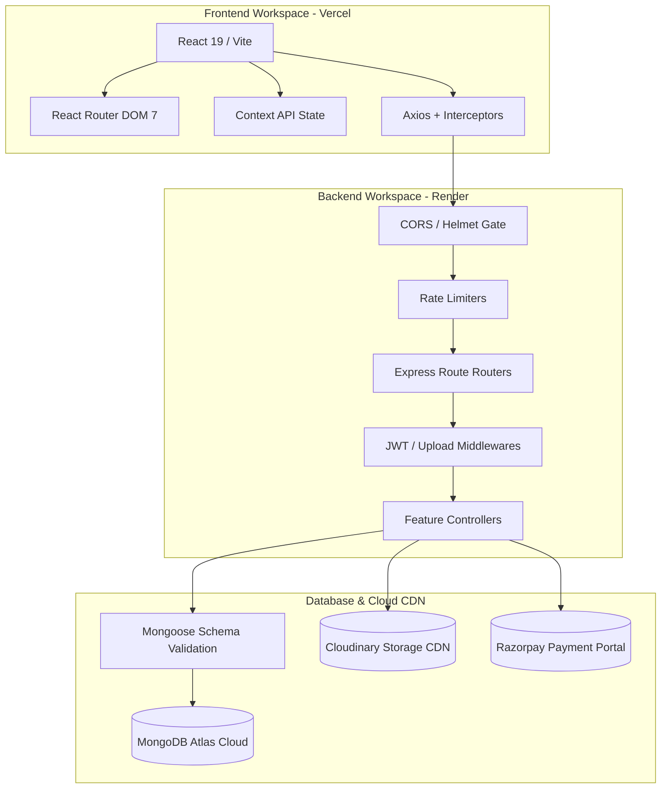
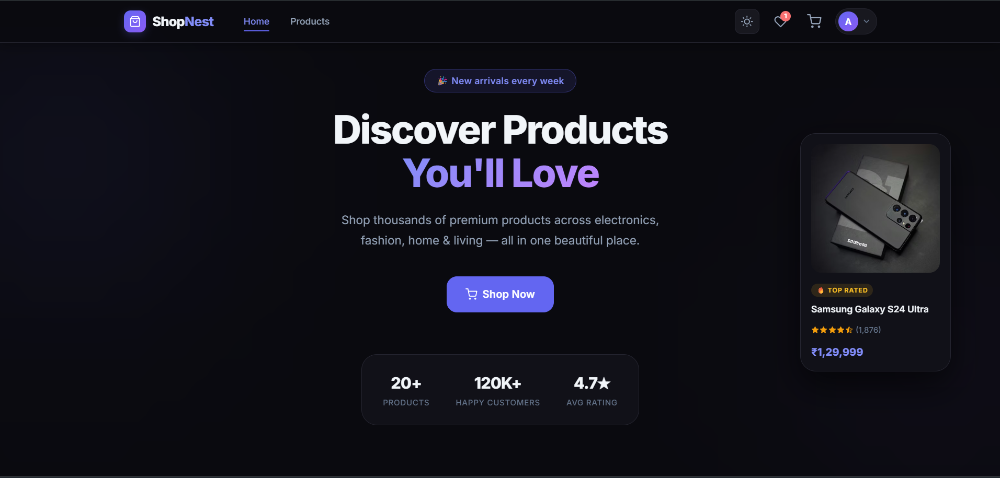
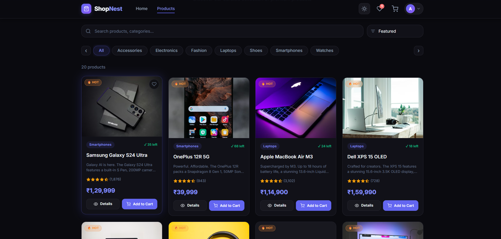
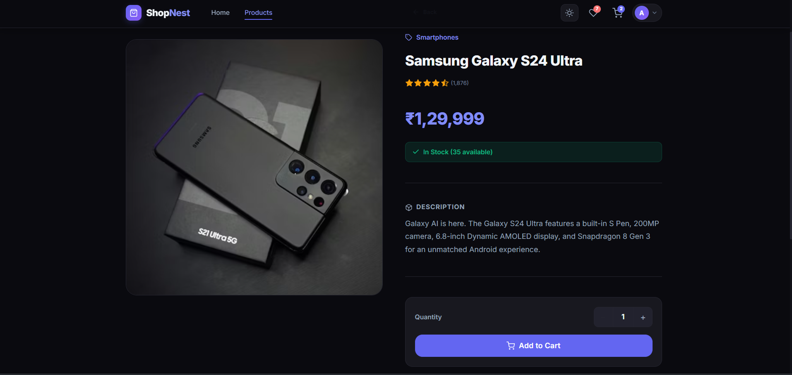
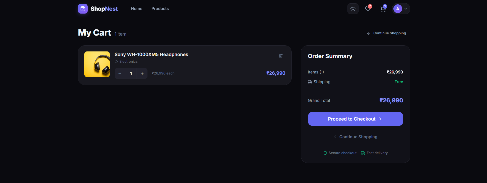
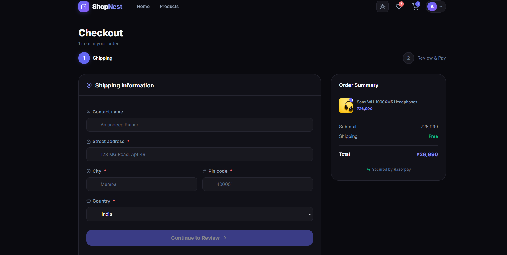
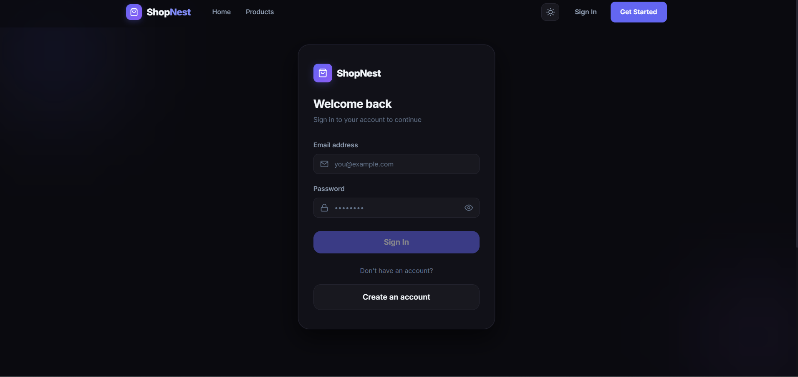
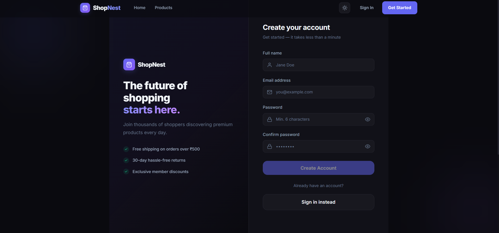
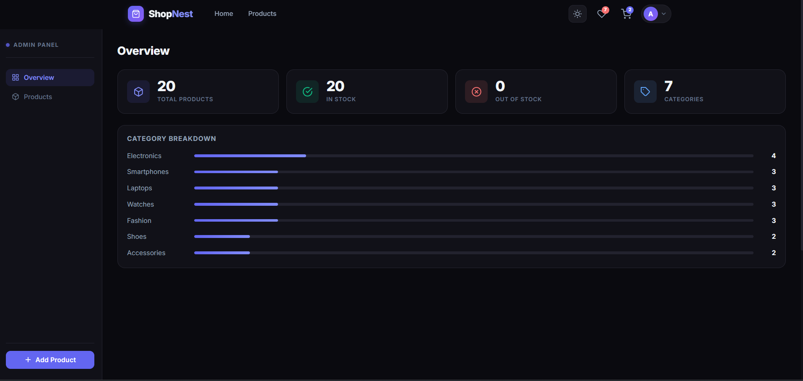
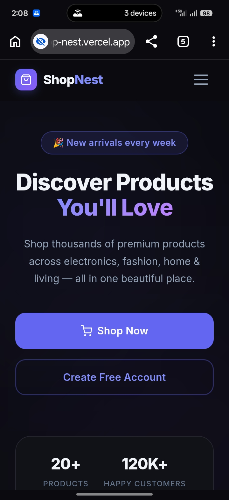

# 🛍️ ShopNest — Production-Grade Full-Stack MERN Ecommerce Platform

<div align="center">

[](https://code-alpha-e-commerce-shop-nest.vercel.app)

[](https://react.dev)
[](https://nodejs.org)
[](https://expressjs.com)
[](https://www.mongodb.com/cloud/atlas)
[](https://razorpay.com)
[](https://jwt.io)
[](https://vercel.com)
[](https://render.com)
[](https://opensource.org/licenses/MIT)

**ShopNest is a premium, startup-grade full-stack MERN ecommerce application featuring secure Razorpay payments, live Cloudinary media management, a robust role-based admin panel, client-side favorites (Wishlist), and optimized micro-interactions.**

---

### 🌐 Live Platform Links

| Resource | Access Link | Status |
| :--- | :--- | :--- |
| **Storefront Web App** | [https://code-alpha-e-commerce-shop-nest.vercel.app](https://code-alpha-e-commerce-shop-nest.vercel.app) | 🟢 Live (Vercel) |
| **Backend API Gateway** | [https://codealpha-e-commerce-shopnest.onrender.com](https://codealpha-e-commerce-shopnest.onrender.com) | 🟢 Operational (Render) |
| **API Health Status** | [https://codealpha-e-commerce-shopnest.onrender.com/api/health](https://codealpha-e-commerce-shopnest.onrender.com/api/health) | 🟢 Operational |
| **GitHub Repository** | [https://github.com/amankumar84912-lang/CodeAlpha_E-Commerce-ShopNest](https://github.com/amankumar84912-lang/CodeAlpha_E-Commerce-ShopNest) | 🟢 Maintained |

</div>

---

## 📖 3. Project Overview

ShopNest represents a production-optimized e-commerce architecture designed to emulate modern, fast-growing startup web applications. Built utilizing the MERN (MongoDB, Express, React, Node.js) stack, the project addresses core real-world engineering hurdles such as:
- **Resilient Cold Starts**: Integrated cold-start detection banners on the frontend that monitor API ping times and alert users when Render backend services are waking up from hibernation, preventing frustrating silent freezes.
- **Fault-Tolerant Integrations**: Built-in support for optional third-party integrations; the server initializes and boots gracefully even in environments where Razorpay or Cloudinary credentials are omitted.
- **Secure Transaction Flows**: Multi-stage client checkouts backed by strict, backend-only HMAC-SHA256 signature verification pipelines.
- **Premium User Experience**: Fast local cache synchronization, search debouncing, layout-shift-free skeleton loading, theme toggling, and quick checkout autofill managers.

---

## ✨ 4. High-Performance Features

### 🛍️ Client & Shopping UX
* 📱 **Modern Glassmorphic Dark/Light Themes**: Dynamic styling with global state context hooks saving user aesthetic preferences to local storage.
* ⚡ **Ultra-Fast Search & Debouncing**: Keeps client-side queries extremely smooth by delaying filters 300ms after user keystrokes, drastically reducing client re-renders.
* 📦 **Layout Shimmer Skeletons**: Zero-cumulative-layout-shift (CLS) experience utilizing responsive CSS skeleton cards matching product card dimensions.
* ❤️ **Dedicated Wishlist Module (`/wishlist`)**: Personal shopper dashboard displaying favorited items with dynamic, animated removal transitions.
* 🕒 **Recently Viewed Sidebar**: Intelligent cookie-free client-side session tracker listing recently inspected items at the bottom of detail pages.
* 📍 **Saved Addresses CRUD**: Fully integrated shipping address card manager directly inside the user profile workspace.
* ⚡ **One-Click Autofill Checkout**: Let shoppers autofill the multi-step checkout form using saved profile address cards in a single tap.
* 🛒 **Persistent Shopping Cart**: Syncs item quantities atomically in the background with backend MongoDB collections.

### 🔐 Security & Operations
* 🔒 **Centralized Express Security**: Full HTTP header protections via Helmet, Mongo query sanitization, XSS mitigation, and strict CORS configs.
* 🚦 **Brute-Force Rate Limiting**: Centralized limits to prevent endpoints abuse (200 requests/15 minutes general, 20 requests/15 minutes for auth).
* 🛂 **Role-Based Protection**: Dynamic React Router guard wrappers (`GuestRoute`, `ProtectedRoute`, `AdminRoute`) ensuring rigid dashboard safety.
* 📊 **Admin Analytics Workspace**: Live dashboards compiling low-stock warnings, inventory monitoring, dynamic bar charts, and text searches.

---

## 🛠️ 5. Technology Stack & Architecture

### Stack Architecture Breakdown



- **Frontend Separation**: Built entirely on top of React 19 and Vite 8 for instant hot-module replacements (HMR) and optimized vendor code splitting.
- **State Management**: Zero complex boilerplate state management tools; uses granular Context hooks (Auth, Cart, Wishlist, Toast, Theme) to keep memory footprint exceptionally small.
- **RESTful Backend Separation**: Purely stateless Express 5 API server communicating over standard JSON structures.

---

## 📁 6. Project Folder Tree

```
CodeAlpha_EcommerceStore/
├── client/                     # Frontend Client Bundle (Vite)
│   ├── public/                 # Static assets and site icons
│   ├── src/
│   │   ├── components/         # Modular Components Workspace
│   │   │   ├── layout/         # Header Navbar, Sticky Footer
│   │   │   ├── product/        # ProductCard, StarRating layouts
│   │   │   ├── routing/        # ProtectedRoute, AdminRoute guards
│   │   │   └── ui/             # PageLoader, Skeletons, Toasts, Wakeup
│   │   ├── context/            # Global contexts (Auth, Cart, Wishlist, Theme)
│   │   ├── hooks/              # Custom utilities (useDebounce)
│   │   ├── pages/              # Application Views (Wishlist, Admin, Profile, Cart)
│   │   ├── services/           # Granular API Client Services (Axios singletons)
│   │   ├── App.jsx             # SPA routing mapping + lazy load bundles
│   │   └── main.jsx            # Context aggregation mount point
│   ├── vercel.json             # Single-Page SPA fallback configuration
│   └── vite.config.js          # Production code chunk splitter config
│
└── server/                     # Backend API Gateway Service
    ├── controllers/            # Pure business logic per API feature
    ├── middleware/             # Role guards, upload controllers, errors
    ├── models/                 # Database Mongoose Schemas (User, Product, Cart, Order)
    ├── routes/                 # Express route endpoint definitions
    ├── utils/                  # Singletons (Cloudinary, Razorpay handler)
    ├── seeder.js               # Demographic database seed pipeline
    └── server.js               # Node entry point + graceful exit handlers
```

---

## 📸 Screenshots

An intuitive, end-to-end visual walkthrough of the ShopNest full-stack shopping and administrative workflows.

### 🏠 Homepage
<p align="center">
  
</p>

<br/>

### 🛍️ Products Page
<p align="center">
  
</p>

<br/>

### 📦 Product Details
<p align="center">
  
</p>

<br/>

### 🛒 Cart Page
<p align="center">
  
</p>

<br/>

### 💳 Checkout Page
<p align="center">
  
</p>

<br/>

### 🔐 Login Page
<p align="center">
  
</p>

<br/>

### 📝 Register Page
<p align="center">
  
</p>

<br/>

### 🛠️ Admin Dashboard
<p align="center">
  
</p>

<br/>

### 📱 Mobile Responsive View
<p align="center">
  
</p>

---

## 🚀 8. Setup & Installation Guide

### Prerequisites
- Node.js version `18.x` or higher installed.
- MongoDB Atlas cluster URL.
- Cloudinary developer API credentials.
- Razorpay test keys (optional - system boots with fallback without them).

### 1. Clone the Codebase
```bash
git clone https://github.com/amankumar84912-lang/CodeAlpha_E-Commerce-ShopNest.git
cd CodeAlpha_E-Commerce-ShopNest
```

### 2. Configure Backend Services
```bash
cd server
npm install
```
Create a `.env` file in the `server` directory:
```env
PORT=5000
NODE_ENV=development
MONGO_URI=mongodb+srv://<username>:<password>@cluster.mongodb.net/shopnest
JWT_SECRET=your_minimum_32_characters_long_super_secret_jwt_key
CLIENT_URL=http://localhost:5173

# Razorpay Payment Gateway (Optional test keys)
RAZORPAY_KEY_ID=rzp_test_YourRazorpayKeyId
RAZORPAY_KEY_SECRET=YourRazorpaySecretKey

# Cloudinary Storage Gateway (For Admin uploads)
CLOUDINARY_CLOUD_NAME=your_cloudinary_name
CLOUDINARY_API_KEY=your_cloudinary_api_key
CLOUDINARY_API_SECRET=your_cloudinary_api_secret
```
Seed initial data and boot the server:
```bash
npm run seed     # Seeds 20 high-fidelity test products
npm run dev      # Launches dev listener at http://localhost:5000
```

### 3. Configure Frontend Client
```bash
cd ../client
npm install
npm run dev      # Launches dev listener at http://localhost:5173
```

---

## 📡 10. Core REST API Endpoints Reference

### User Authentication Routes
| Method | Endpoint | Auth Level | Description |
| :--- | :--- | :--- | :--- |
| **POST** | `/api/auth/register` | Public | Registers a new shopper profile |
| **POST** | `/api/auth/login` | Public | Exchanges credentials for a 30-day JWT |
| **PUT** | `/api/auth/profile` | Signed User | Modifies name, email, or security passwords |

### Product Catalog Routes
| Method | Endpoint | Auth Level | Description |
| :--- | :--- | :--- | :--- |
| **GET** | `/api/products` | Public | Returns debounced catalogue filters and sorting |
| **GET** | `/api/products/:id` | Public | Returns detailed catalog document |
| **POST** | `/api/products` | Admin Only | Inserts new product to catalogue database |
| **PUT** | `/api/products/:id` | Admin Only | Updates catalog properties dynamically |
| **DELETE** | `/api/products/:id` | Admin Only | Deletes catalog document permanently |

### Shopping Cart Routes
| Method | Endpoint | Auth Level | Description |
| :--- | :--- | :--- | :--- |
| **GET** | `/api/cart` | Signed User | Fetches populated cart list for current shopper |
| **POST** | `/api/cart` | Signed User | Inserts catalog item with desired quantity |
| **PUT** | `/api/cart/:productId` | Signed User | Modifies target item quantity atomically |
| **DELETE** | `/api/cart/:productId` | Signed User | Removes target item from cart |
| **DELETE** | `/api/cart` | Signed User | Clears all items (after order placement) |

### Order & Payments Routes
| Method | Endpoint | Auth Level | Description |
| :--- | :--- | :--- | :--- |
| **POST** | `/api/orders` | Signed User | Places COD order or creates pending order |
| **GET** | `/api/orders` | Signed User | Fetches historical order summary for user |
| **POST** | `/api/payment/create-order` | Signed User | Registers an order instance directly on Razorpay |
| **POST** | `/api/payment/verify` | Signed User | Verifies Razorpay signatures using HMAC-SHA256 |

---

## 🎯 15. Engineering Challenges & Core Learnings

During production launch and optimization phases, several high-impact engineering hurdles were identified and resolved:

### 1. Resilient Cold-Start Handling
- **Challenge**: The API is deployed on a free tier of Render which hibernates after 15 minutes of inactivity. When a fresh user loaded the page, Axios requests failed or took over 50 seconds to complete, creating a broken visual experience.
- **Solution**: Developed a lightweight [RenderWakeup.jsx](file:///d:/Onedrive/Desktop/CodeAlpha_EcommerceStore/client/src/components/ui/RenderWakeup.jsx) banner. It queries the `/api/health` gateway on site load. If a cold start latency is detected, it renders a subtle, animated glassmorphic bar indicating the database server is booting, maintaining transparency with users.

### 2. Optional Payment Gateway Resilience
- **Challenge**: Standard Razorpay client initialization crashes the entire Node process during startup if environment credentials are missing, causing deployment failures for reviewers without active merchant IDs.
- **Solution**: Refactored the core singleton in [razorpay.js](file:///d:/Onedrive/Desktop/CodeAlpha_EcommerceStore/server/utils/razorpay.js) to catch errors silently, fallback to COD (Cash on Delivery) routes gracefully if test keys are absent, and log warning flags without process terminations.

### 3. Cumulative Layout Shift Optimization
- **Challenge**: Fast asynchronous product image listings were inflating layout cards unevenly as image assets downloaded, throwing off scrolling states.
- **Solution**: Constrained the responsive image blocks inside fixed aspect-ratio wrapper divs with absolute-centered image tags, added lazy loading attributes to all cards, and implemented smooth shimmer skeletons during image loading.

---

## 👨‍💻 16. Author Profiles

**Amandeep Kumar**
- 🎓 **Academic**: B.Tech Computer Science & Engineering Student
- 💼 **Specialization**: Full Stack Developer / MERN Engineer
- 🌐 **LinkedIn**: [www.linkedin.com/in/amandeep-kumar-266780253](#)
- 🖥️ **Developer Portfolio**: [amankumar-portfolio.dev](#)
- ✉️ **Email Contact**: [amankumar84912@gmail.com](#)

---

## 📄 17. License

This project is licensed under the terms of the [MIT License](https://opensource.org/licenses/MIT).
