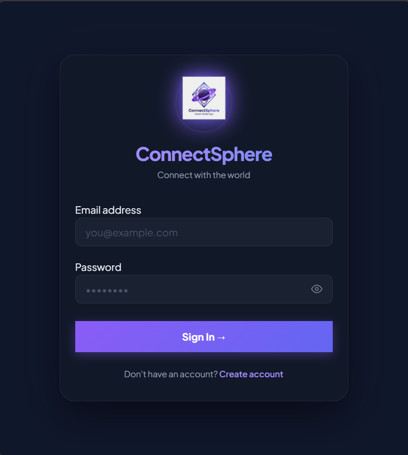
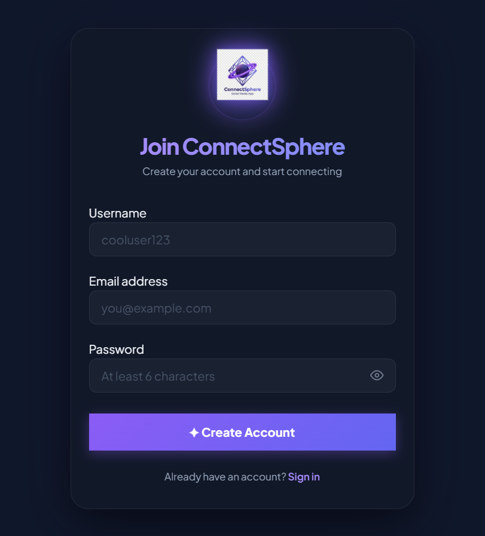
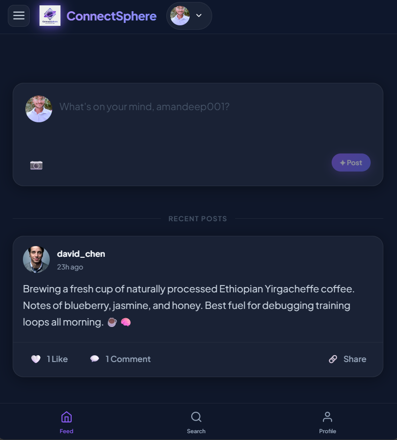
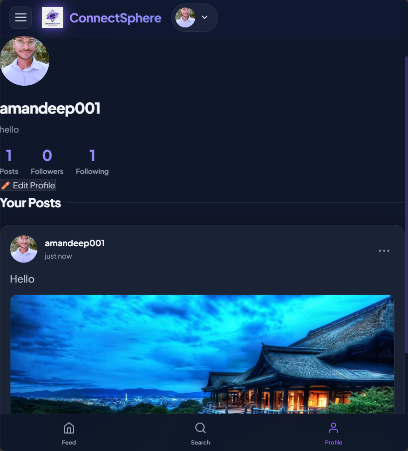
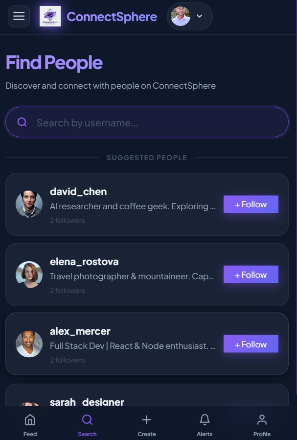
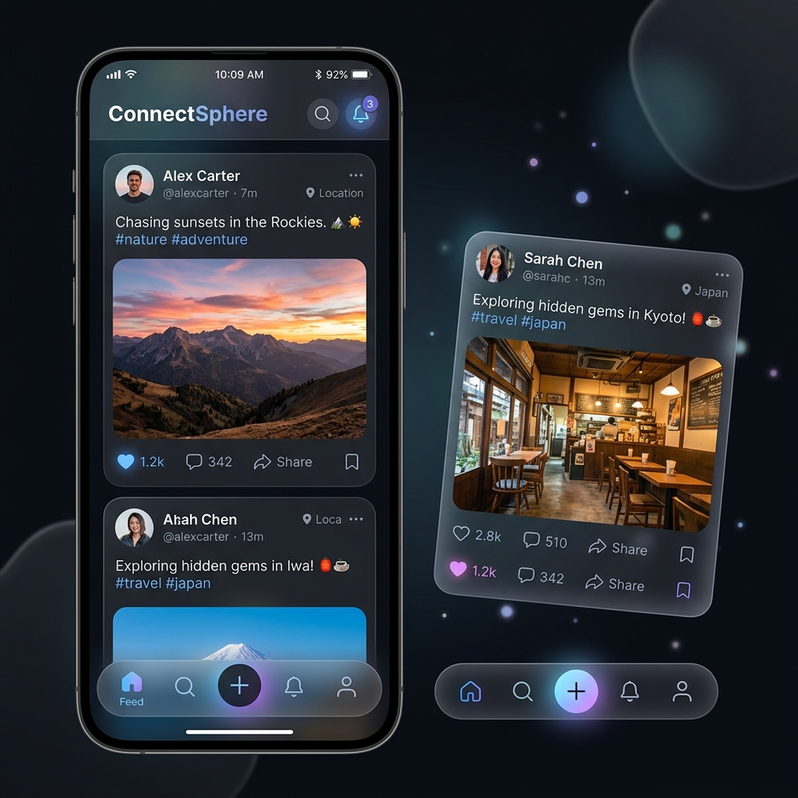
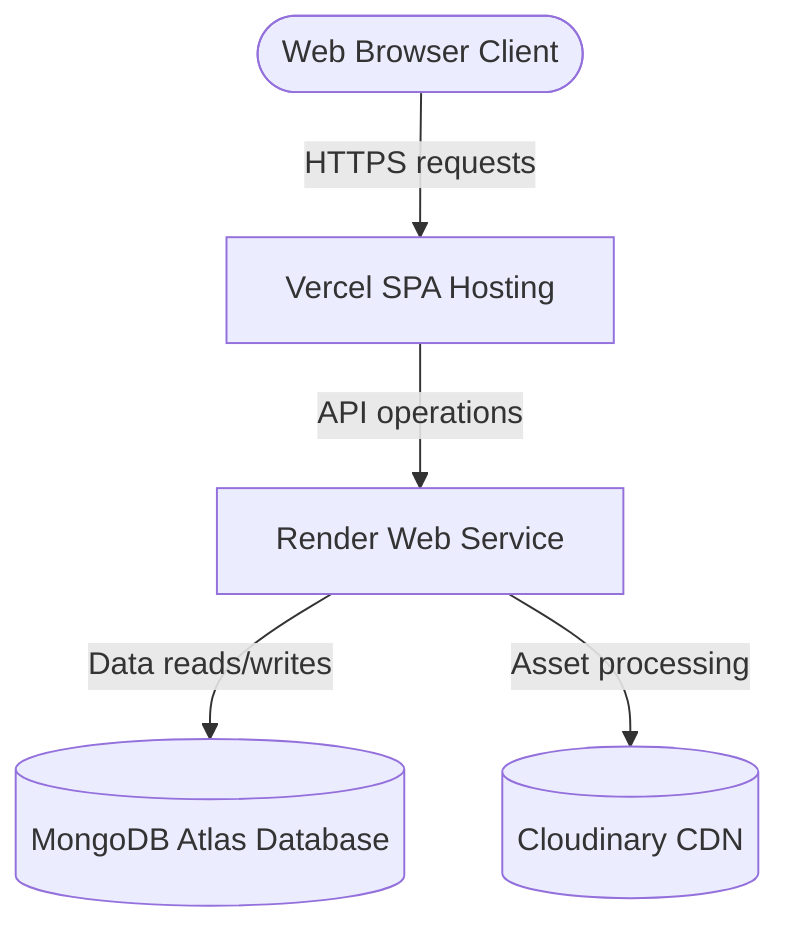

# 🚀 CodeAlpha Internship Projects

### Full Stack MERN Applications Developed During CodeAlpha Internship

[](https://react.dev/)
[](https://nodejs.org/)
[](https://expressjs.com/)
[](https://www.mongodb.com/)
[](https://developer.mozilla.org/en-US/docs/Web/JavaScript)
[](https://vercel.com/)
[](https://render.com/)
[](https://opensource.org/licenses/MIT)

---

## 📌 Internship Overview

This repository showcases the MERN stack web applications designed and developed during the **CodeAlpha Full Stack Development Internship**. Each project represents a standalone, production-ready SaaS application built to demonstrate high-level proficiency in modern web engineering practices.

### Core Focus Areas:
*   **Frontend Development:** Component-based SPA design, context management, layout engines, and dynamic user interfaces with fluid micro-interactions.
*   **Backend Development:** REST API design, rate-limiting, custom middleware pipelines, and secure transaction verification.
*   **Database Design:** Document validation, index configurations, relational reference models, and transactional integrity.
*   **API & Security Integrations:** JSON Web Token authentication boundaries, third-party payment handshakes (Razorpay), and cloud media storage pipelines (Cloudinary).
*   **Deployment & Ops:** Cross-origin security management (CORS), cloud environments configuration (Render + Vercel), and deployment processes.

---

## 📂 Repository Structure

```text
CodeAlpha_Tasks/
│
├── CodeAlpha_EcommerceStore/   # E-Commerce Web Application (Client & Server)
│   ├── client/                 # React frontend client
│   ├── server/                 # Express REST API server
│   └── screenshots/            # Product screenshots & mockups
│
├── CodeAlpha-SocialMedia-ConnectSphere/ # Social Media Platform (Client & Server)
│   ├── client/                 # React frontend client
│   ├── server/                 # Express REST API server
│   └── screenshots/            # Product screenshots & mockups
│
├── LICENSE                     # Repository Open Source License
└── README.md                   # Repository Master Documentation
```

---

## 📋 Projects Overview Table

| Task | Project | Category | Tech Stack | Status |
| :---: | :--- | :--- | :--- | :---: |
| **Task 1** | [ShopNest](#-task-1--shopnest) | E-Commerce Web App | React, Node.js, Express, MongoDB, Razorpay, Tailwind/CSS | ✅ Completed |
| **Task 2** | [ConnectSphere](#-task-2--connectsphere) | Social Media Platform | React, Node.js, Express, MongoDB, Cloudinary, Framer Motion | ✅ Completed |

---

# 🛒 Task 1 — ShopNest

### Project Overview
ShopNest is a modern, full-featured MERN e-commerce application designed to provide users with a clean shopping experience and administrators with a comprehensive inventory management console.

### Key Features
*   **Secure Authentication:** JWT-based secure signup, login, and dashboard gates.
*   **Product & Category Catalog:** Dynamic browsing, search filtering, and categorized inventory displays.
*   **Shopping Cart & Wishlist:** Fully interactive user cart with local state caching and database persistence.
*   **Razorpay Gateway:** Integrated sandboxed checkout pipeline to safely handle dummy payments.
*   **Admin Console:** Dedicated administrative dashboard to add, edit, and delete products and track customer orders.
*   **Responsive UI:** Mobile-optimized e-commerce interface using CSS flex/grid structures.

### Tech Stack
*   **Frontend:** React, Vite, React Router, Axios, Context API, Vanilla CSS / Tailwind
*   **Backend:** Node.js, Express.js, Razorpay Node SDK, JWT
*   **Database:** MongoDB Atlas, Mongoose
*   **Hosting:** Vercel (Client), Render (API Server)

### Project Architecture
```text
Client (React UI) ──[Axios Requests]──> Express API Server ──[Mongoose Queries]──> MongoDB Atlas
       │                                       │
       └──[Sandboxed Transactions]──> Razorpay Payment API
```

### ShopNest Screenshots
| Homepage | Products Gallery |
| :---: | :---: |
|  <br> *Dynamic landing page displaying featured categories* |  <br> *Grid view of available products with search filters* |

| Product Details Page | Shopping Cart Page |
| :---: | :---: |
|  <br> *Detailed product description, inventory, and Add to Cart trigger* |  <br> *Items listing showing quantity updates and pricing totals* |

| Secure Checkout | Admin Dashboard Console |
| :---: | :---: |
|  <br> *Payment processing form integrated with Razorpay gateway* |  <br> *Product catalog editor, inventory controller, and orders monitor* |

| User Sign-in Portal | User Signup Page | Mobile Responsive View |
| :---: | :---: | :---: |
|  <br> *Access control login* |  <br> *Customer onboarding* |  <br> *Mobile layout view* |

### ShopNest Deployment Links
*   **Live Client Application:** [ShopNest Web Portal](https://shopnest-client.vercel.app)
*   **Backend REST API:** [ShopNest API Server](https://shopnest-server.onrender.com)
*   **Source Code:** [GitHub Directory](https://github.com/amankumar84912-lang/CodeAlpha-SocialMedia-ConnectSphere/tree/main/CodeAlpha_EcommerceStore)

---

# 🌐 Task 2 — ConnectSphere

### Project Overview
ConnectSphere is a high-performance, dark-mode social networking platform built with a premium glassmorphic visual style. It features a complete social graph enabling interactive networking feeds.

### Key Features
*   **Dynamic Social Graph:** Real-time follow/unfollow relationships updates with dynamic feed compilation.
*   **Interactive Chronological Feed:** High-fidelity user dashboard serving posts created by followed users and self.
*   **Instant Likes & Comments:** Optimistic frontend updates for post interactions synced with database updates.
*   **Cloud Image Uploads:** On-the-fly photo uploads hosted via Cloudinary API with automatic CDN scaling.
*   **Debounced Username Search:** Sanitized database search matching usernames dynamically to prevent injection exploits.
*   **Interactive Profiles:** Live profile editor allowing bio customizations and avatar uploads.

### Tech Stack
*   **Frontend:** React, Vite, React Router, Framer Motion, Axios, React Hot Toast
*   **Backend:** Node.js, Express.js, Multer, Cloudinary SDK, JWT, Express Rate Limit
*   **Database:** MongoDB Atlas, Mongoose
*   **Hosting:** Vercel (Client), Render (API Server)

### Project Architecture
```text
Client (React UI) ──[Axios Requests]──> Express API Server ──[Mongoose Queries]──> MongoDB Atlas
       │                                       │
       └──[Avatar & Post Media]────────> Cloudinary CDN
```

### ConnectSphere Screenshots
| Login Page | Register Page |
| :---: | :---: |
|  <br> *Access control sign-in with active session verification* |  <br> *User signup flow validation check* |

| Feed Page | User Profile View |
| :---: | :---: |
|  <br> *Chronological post stream showing media content, likes, and comments* |  <br> *User feed timeline, display configurations, and relation statistics* |

| Search & Discovery Page | Mobile Bottom-Nav View |
| :---: | :---: |
|  <br> *Debounced username lookup with suggestions* |  <br> *Mobile responsive view showcasing bottom navigation navigation* |

### ConnectSphere Deployment Links
*   **Live Client Application:** [ConnectSphere Web Portal](https://connectsphere-client.vercel.app)
*   **Backend REST API:** [ConnectSphere API Server](https://connectsphere-server.onrender.com)
*   **Source Code:** [GitHub Directory](https://github.com/amankumar84912-lang/CodeAlpha-SocialMedia-ConnectSphere/tree/main/client)

---

## 🛠 Skills Demonstrated

### Frontend Engineering
*   **SPA Architecture:** Developed structured client routers with nested state rendering in React Router.
*   **State Providers:** Built React Context providers for authentication workflows and custom UI theme toggles.
*   **Motion Frameworks:** Configured fluid page transitions and interactive animations using Framer Motion.
*   **Responsive Styling:** Programmed responsive grid structures, flex layouts, and custom properties in CSS.

### Backend & API Design
*   **RESTful Routing:** Standardized API route layouts mapping HTTP verbs (GET, POST, PUT, DELETE) to stateless controllers.
*   **Middleware Engineering:** Configured JWT authentication checks, Express Rate Limit boundaries, and Express Validator verification schemas.
*   **File Stream Pipelines:** Streamed memory storage buffers straight to Cloudinary servers.

### Database Design & Integration
*   **Database Modeling:** Drafted mongoose schema files enforcing indexing rules, value validation, and referencing structures.
*   **Performance Tuning:** Pre-loaded user reference details inside queries using Mongoose `.populate()`.

### Cloud Ops & Deployments
*   **Decoupled Server Hosting:** Configured CORS origins, production environment variables, and build variables on Render and Vercel.

---

## ⚡ Deployment Architecture

All projects in this repository are deployed utilizing a decoupled stack structure to maximize performance, scalability, and service separation:



---

## 🛠️ Challenges Solved

### E-Commerce (ShopNest)
*   **CORS Connection Blockers:** Addressed cross-origin requests blocked by browsers in production by binding specific, authorized Vercel domain origins inside the backend Express CORS configuration.
*   **Razorpay Integration:** Handled asynchronous payment completions securely by implementing verification handshakes inside database transaction endpoints.
*   **Render Cold Starts:** Resolved Render free tier spin-up delays by implementing database check configurations and graceful loading indicators on the frontend client.

### Social Media (ConnectSphere)
*   **Express Param Route Collision:** Fixed a routing bug where `/api/users/search` clashed with `/api/users/:id` by organizing static matching routes prior to parameterized matching patterns in the routing config.
*   **Follower Social Graph Complexity:** Managed mutual follow relationships by implementing atomic Mongoose operators (`$addToSet` and `$pull`) to update both accounts synchronously in a single transaction.
*   **Search Query Performance:** Prevented server performance bottlenecks by debouncing username search fields and sanitizing input text with regex check boundaries to block ReDoS attempts.

---

## ⚙️ Installation Guide

Follow these steps to run either of the projects locally on your computer:

### 1. Repository Setup
```bash
git clone https://github.com/amankumar84912-lang/CodeAlpha-SocialMedia-ConnectSphere.git
cd CodeAlpha-SocialMedia-ConnectSphere
```

### 2. Run ShopNest (Task 1)
Open the ShopNest folder in your terminal (which corresponds to `CodeAlpha_EcommerceStore` inside the root):
```bash
cd CodeAlpha_EcommerceStore
```
#### Backend Setup:
1. Navigate to the server folder: `cd server`
2. Install dependencies: `npm install`
3. Create a `.env` file and supply:
   ```env
   PORT=5000
   MONGO_URI=your_mongodb_atlas_connection_string
   JWT_SECRET=your_jwt_secret_key
   RAZORPAY_KEY_ID=your_razorpay_key
   RAZORPAY_KEY_SECRET=your_razorpay_secret
   CLIENT_URL=http://localhost:5173
   ```
4. Start the server: `npm run dev`

#### Frontend Setup:
1. Open a new terminal window and navigate to the client folder: `cd ../client`
2. Install dependencies: `npm install`
3. Create a `.env` file and supply:
   ```env
   VITE_API_URL=http://localhost:5000/api
   ```
4. Start the client: `npm run dev`

---

### 3. Run ConnectSphere (Task 2)
Open the ConnectSphere folder in your terminal:
```bash
# Return to repository root, then navigate to ConnectSphere folder
cd CodeAlpha-SocialMedia-ConnectSphere
```
#### Backend Setup:
1. Navigate to the server folder: `cd server`
2. Install dependencies: `npm install`
3. Create a `.env` file and supply:
   ```env
   PORT=5000
   MONGO_URI=your_mongodb_atlas_connection_string
   JWT_SECRET=your_jwt_secret_key
   CLOUDINARY_CLOUD_NAME=your_cloudinary_cloud_name
   CLOUDINARY_API_KEY=your_cloudinary_api_key
   CLOUDINARY_API_SECRET=your_cloudinary_api_secret
   CLIENT_URL=http://localhost:5173
   ```
4. Start the server: `npm run dev`

#### Frontend Setup:
1. Open a new terminal window and navigate to the client folder: `cd ../client`
2. Install dependencies: `npm install`
3. Create a `.env` file and supply:
   ```env
   VITE_API_URL=http://localhost:5000/api
   ```
4. Start the client: `npm run dev`

---

## 🎓 Internship Learning Outcomes

*   **Engineering Decoupled Web Applications:** Developed deep experience in separating concerns between single-page frontends and stateless backend APIs.
*   **Data Consistency:** Learned to manage schemas, relational models, and asynchronous operations in NoSQL databases.
*   **Third-Party Payments:** Gained hands-on experience integrating sandbox payment gateways (Razorpay) and verifying transaction payloads.
*   **Security Frameworks:** Implemented request rate-limiters, password crypt hashing, parameter validator checks, and header guards.
*   **Cloud Infrastructure:** Learned to structure production environment configurations across multiple hosting providers.

---

## 👨‍💻 Author

**Amandeep Kumar**
*   B.Tech Computer Science Engineering Student
*   **Role:** Full Stack Developer
*   **GitHub:** [@amankumar84912-lang](https://github.com/amankumar84912-lang)
*   **LinkedIn:** [Amandeep Kumar](https://linkedin.com/in/amankumar84912)

---

## 📄 License

This repository is licensed under the MIT License - see the [LICENSE](LICENSE) file for details.
